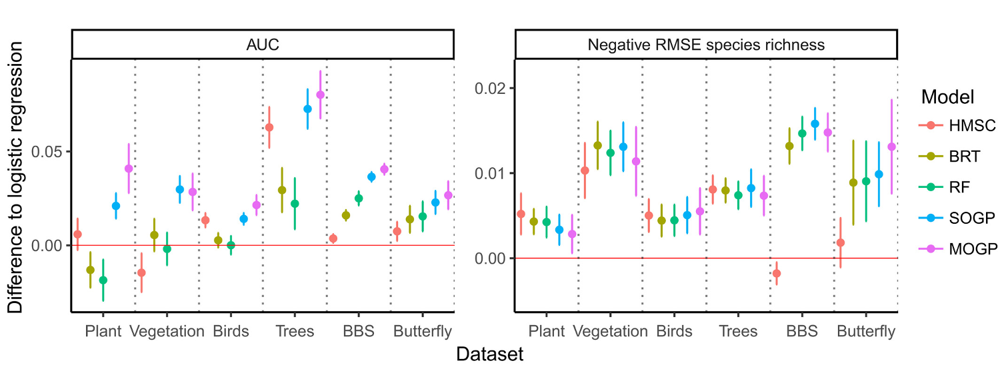
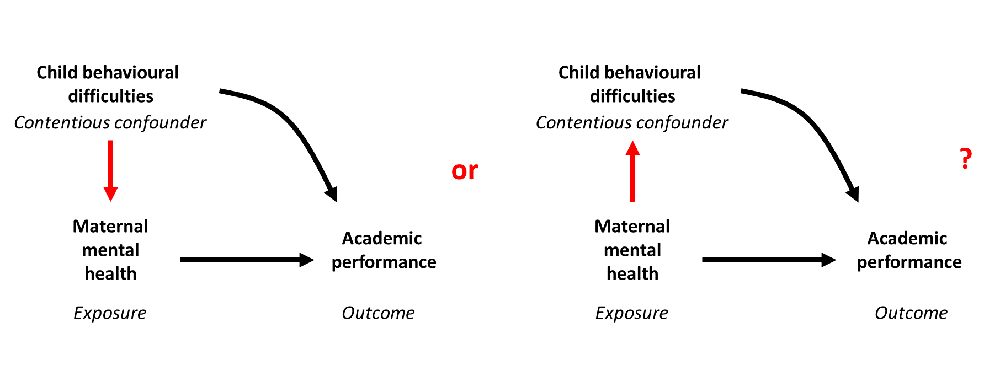

<style type="text/css">
.remark-slide-content {
    font-size: 24px;
}
</style>


# Student's predicament

$X_1, X_2, \dots, X_n \sim \mathrm{N}(\mu_1, \sigma_1^2)$

$Y_1, Y_2, \dots, Y_m \sim \mathrm{N}(\mu_2, \sigma_2^2)$

--

Want to compare $\mu_1$ and $\mu_2$

--

Can we assume $\sigma_1 = \sigma_2$?

--

In R, which of these should we run?
```
t.test(x, y)
t.test(x, y, var.equal = TRUE)
```


---

# The 'true model myth'

--

Analysis process:

1. Determine the best model
2. Derive (all of the) answers from this model

--

Implicit assumptions:

* Our goal is to find the 'true' model
* We can use our 'best' model as if it were the 'true' model

--

(Similar to misuse of statistical significance?  
 An overly 'black and white' view of the data?  
 Ignores model uncertainty...)


---

# Antidotes


The idea of a 'statistical investigation'

--

See:

* [Wild & Pfannkuch (1999)](https://doi.org/10.1111/j.1751-5823.1999.tb00442.x)
* **Robert Gould**'s keynote talk yesterday, mentioned 'The Data Cycle'

--

A statistical investigation will typically investigate **multiple** models

--

(...and we might never need to choose between them!)

--

Let's show such examples to students.


---

# Reasons for using multiple models

1. Comparing & optimising performance
2. Exploring different assumptions
3. Exploring different questions
4. Varying the desired estimation properties


---

# 1. Comparing & optimising performance

--

Routinely done for **predictive modelling**

--

...including creating ensembles of **multiple** models


---

# Example: species distribution modelling



.footnote[
.font70[
Adapted from [Ingram, Vukcevic & Golding (2020)](https://doi.org/10.1111/2041-210X.13496)
]
]

---

# 2. Exploring different assumptions

--

Common scenario: **sensitivity analyses**


---

# Example: t-test

```{r example-data, cache = TRUE, include = FALSE}
set.seed(2021)
x <- rnorm(20, 3)
y <- rnorm(25, 0, 2)
```

.pull-left[

**Different variances** (Welch approximation)

```{r t-test-welch, eval = FALSE}
t.test(x, y)
```

$t = 7.85$

$\mathrm{df} = 36.1$

$\textrm{p-value} = 2.5 \times 10^{-9}$

$\textrm{95% CI} = (3.00, 5.08)$

]

--

.pull-right[

**Pooled variance**

```{r t-test-pooled, eval = FALSE}
t.test(x, y, var.equal = TRUE)
```

$t = 7.32$

$\mathrm{df} = 43$

$\textrm{p-value} = 4.5 \times 10^{-9}$

$\textrm{95% CI} = (2.93, 5.15)$

]

---

# Example: prior sensitivity analysis

```{r bayes-sensitivity, echo = FALSE, fig.width = 15}
par(mfrow = c(1, 2))

col1 <- "blue"
col2 <- "green3"
col3 <- "magenta"

curve(xlab = expression(theta), ylab = "Probability density", ylim = c(0, 4.2),
      main = "Prior pdf",
      dbeta(x, 0.1, 0.1), from = 0, to = 1,    lwd = 3, col = col1, n = 200)
curve(dbeta(x, 1,   1  ), add = TRUE,          lwd = 2, col = col2)
curve(dbeta(x, 0.5, 0.5), add = TRUE, lty = 2, lwd = 3, col = col3, n = 200)

curve(xlab = expression(theta), ylab = "", ylim = c(0, 4.2),
      main = "Posterior pdf",
      dbeta(x, 15.1, 5.1), from = 0, to = 1,    lwd = 3, col = col1)
curve(dbeta(x, 16,   6  ), add = TRUE,          lwd = 2, col = col2)
curve(dbeta(x, 15.5, 5.5), add = TRUE, lty = 2, lwd = 3, col = col3)
```


---

# Example: causal inference




---

# 3. Exploring different questions

Some clear examples:

* Changing the response variable
* Changing the 'primary' explanatory variables

--

But sometimes it's less clear...


---

# Example: ANOVA vs polynomial regression

```{r anova-polynomial, echo = FALSE, fig.width = 15}
set.seed(2021)
ff <- function(x)
    15 - 0.4 * (x - 4.1)^2

x <- rep(1:5, each = 7)
y <- rnorm(x, ff(x))

m0 <- lm(y ~ factor(x))
m1 <- lm(y ~ poly(x, 2))

xx0 <- 1:5
xx1 <- seq(0.5, 5.5, length.out = 101)
pp0 <- predict(m0, newdata = data.frame(x = xx0), interval = "confidence")
pp1 <- predict(m1, newdata = data.frame(x = xx1), interval = "confidence")
```

.pull-left[
.center[

```{r anova-polynomial-data, echo = FALSE, fig.width = 8}
plot(x, y, main = "Data", col = "purple", cex = 1.5, lwd = 2)
```

]
]

--

.pull-right[
.center[

```{r anova-polynomial-fits, echo = FALSE, fig.width = 8}
suppressMessages(library(gplots))
matplot(xx1, pp1, type = "n", lwd = 2, ylim = range(y), col = c(1, 3, 3),
        xlab = "x", ylab = "y", main = "Model fits")
plotCI(xx0, pp0[, "fit"],
       li = pp0[, "lwr"],
       ui = pp0[, "upr"],
       add = TRUE, pch = 19, sfrac = 0, gap = 0, col = "blue", lwd = 3,
       cex = 1.5)
```

]
]


---

# Example: ANOVA vs polynomial regression

.pull-left[
.center[

`)

]
]

.pull-right[
.center[

```{r anova-polynomial-fits2, echo = FALSE, fig.width = 8}
matplot(xx1, pp1, type = "l", lwd = 2, ylim = range(y), col = c(1, 3, 3),
        xlab = "x", ylab = "y", main = "Model fits")
plotCI(xx0, pp0[, "fit"],
       li = pp0[, "lwr"],
       ui = pp0[, "upr"],
       add = TRUE, pch = 19, sfrac = 0, gap = 0, col = "blue", lwd = 3,
       cex = 1.5)
```

]
]


---

# 4. Varying the desired estimation properties

--

Typical trade-off: **bias** vs **variance**


---

# Example: ANOVA vs polynomial regression

.pull-left[
.center[

`)

]
]

.pull-right[
.center[

`)

]
]
---

# When teaching students...

Create examples that feature **multiple** models/techniques.

--

### Handy reference

Possible reasons for using multiple models:

1. Comparing & optimising performance
2. Exploring different assumptions
3. Exploring different questions
4. Varying the desired estimation properties
